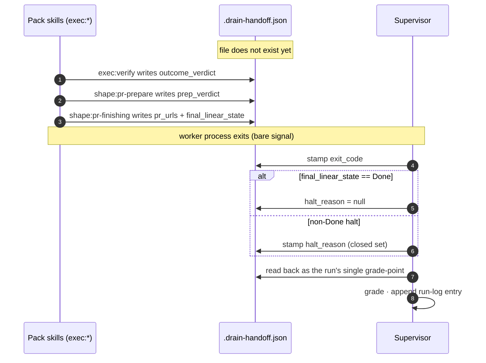

# ADR 0002: Thin-supervisor contract — prompt-segment allocation, handoff schema v2, process/workflow boundary

**Date:** 2026-06-16
**Status:** Accepted (plan-review at `docs/adrs/references/0002-thin-supervisor-contract-plan-review.md`)

Decides the supervisor↔worker contract: the ≤15-line worker prompt template's segment allocation, `.drain-handoff.json` schema v2, and the process/workflow boundary across every `drain_cycle/` concern. Extends the pack's execution-workflow design doc (A/N04, `agent-skills-shaper/docs/design-docs/execution-workflow/design-doc.md`) with the supervisor-seam columns — it does not re-decide the `exec:*` skill graph.

## Context

The drain-cycle supervisor's worker prompt today inlines the workflow it wants the worker to follow: a preamble names the worktree and base branch, then a tail script enumerates "review → fix → commit → push → comment → transition to Done." `drain_cycle/prompt.py` emits ~80–120 lines depending on stack mode, and `flow.py` branches the tail on the `verify` label. The same procedure is also owned by the pack's `exec:*` skills — two sources of truth for one workflow.

Affected parties: the drain-cycle supervisor (one prompt template per state; rewrites every time a skill changes its trail artefacts), pack-skill authors (cannot evolve `exec:finish` without a coordinated edit in the supervisor repo), and non-Claude workers (codex, kimi) that today either re-implement the inlined procedure or skip steps silently. The handoff file `.drain-handoff.json` v1 carries `pr_urls`, `final_linear_state`, and `exit_code` — enough to grade a run but not enough to inspect *why* a worker halted or *which AC items* it failed.

Current behaviour: the prompt prescribes the workflow; the pack's skills also prescribe it; drift between them is silently absorbed by the worker. Desired behaviour: the supervisor names one skill pointer and the operational facts the worker needs to run (worktree, base branch, stack mode, resume marker); the pack owns every workflow step; the handoff file records the verdicts the supervisor needs to grade and the operator needs to inspect.

**The predecessor.** The pack's execution-workflow design doc (A/N04) reserved the `exec:*` namespace, pinned the skill graph (`exec:pickup → exec:breakdown → exec:build → … → exec:finish`), and defined `pickup-envelope.json` as the in-flight carrier across skills. This contract extends A/N04 with the *supervisor-seam* — what the supervisor passes in and what the run leaves behind — without re-deciding the skill graph or the envelope.

The migration consequence is bounded. A/N04's supervisor-binding audit found that `drain_cycle/prompt.py` currently emits exactly two execution-side verbs literally: `/code-review-and-quality` (4 string locations) and `/shape:task` (the verify-flow directive). The remaining completion-sequence prose (commit/push, review-summary comment, Linear Done transition) is inlined as prose, not delegated. The literal `/code-review-and-quality` swap to `/exec:review` happens via `exec:finish`/`exec:pickup` taking ownership (pack-side); this contract decides the *shape* of the prompt that survives the swap and the schema the verdicts land in.

`drain_cycle/orchestrator.py:505` resolves the per-run `stack` flag from the `--no-stack` CLI flag and the `push_to_main_repos` config (`stack = target_repo.name not in repos.push_to_main_repos and not no_stack`). Today this fact picks the preamble variant emitted (normal vs stack). After collapse, the worker still needs to know which mode it is in to delegate to `shape:pr-finishing` correctly (Graphite stack vs gh PR). The signal must survive.

`drain_cycle/flow.py` today gates a multi-role verify pipeline (Task-Shaper → Implementer → Outcome Verifier → PR Preparer) on the issue's `verify` label; without the label a drain runs the default single-worker flow. **This contract makes verification universal**: the Outcome Verifier and PR Preparer run on every drain, not a labelled subset, so the gate selects nothing. `flow.py` deletes, the `verify` label stops being a routing input, and the handoff carries no `flow` field — there is one flow, so there is no path to record. The boundary chart below allocates the deletion.

Adjacent decisions (in the pack repo): agent-skills-shaper ADR 0003 (persona-dispatch contract; locates vendor-specific branching inside `exec:review` only), agent-skills-shaper ADR 0004 (`exec:*` verb namespace). KR3's measurement clause: `wc -l` on the worker prompt template ≤15; grep for procedure-verb slash-commands over `drain_cycle/` returns empty.

### Constraints

**Functional.**

- The worker prompt template must transmit *only* process facts and a single skill pointer. No procedure prose. No conditional branches inside the prompt body.
- The `stack` mode is a supervisor-resolved fact; it must reach the worker via the prompt template (not via a file the skill loads). Label-driven supervisor decisions (`repo:`, `model:`, `review:`) are resolved before the worker spawns and do not reach the prompt.
- `.drain-handoff.json` must carry the verdict fields the supervisor reads at run-end to (a) grade the run, (b) build the run-log entry, and (c) name the halt reason on any non-Done exit. Every field has a named writer and a named reader.
- The schema must extend A/N04's `pickup-envelope.json` rather than duplicate it. `pickup-envelope.json` is the in-flight carrier *between skills*; `.drain-handoff.json` is the exit record *from the worker back to the supervisor*.
- A non-Claude worker reading the prompt must be able to follow it. No Claude-Code-only tool names. No SDK-specific framings.

**Non-functional.**

| NFR | Target | Fitness function |
|---|---|---|
| Worker prompt template size | ≤15 lines including blanks | `wc -l drain_cycle/prompt_template.txt` ≤ 15 on the rendered template skeleton (before issue-body substitution) |
| Procedure-verb absence | No execution slash-command in the supervisor source other than `/exec:pickup` | `git grep -nE '/(code-review\|shape:(pr-\|verify-\|task)\|exec:(build\|review\|verify\|finish\|breakdown\|debug\|simplify))' drain_cycle/` returns empty |
| Schema-v2 fitness | `.drain-handoff.json` produced by any worker exit parses against the JSON Schema in `docs/adrs/references/drain-handoff-schema-v2.md` and every required field is present per its writer's exit gate | Extract the fenced JSON Schema, validate every `~/.drain-cycle/runs/*.json` against it; exit 0 on every fixture and every live run |
| Vendor portability | The prompt template contains zero references to `Claude`, `Anthropic`, `Skill` (capitalised), `Agent` (capitalised), or any tool-search call | `grep -iE '(claude\|anthropic\|toolsearch\|agent tool)' drain_cycle/prompt_template.txt` returns empty |
| Handoff parse cost | `jq` parse of `.drain-handoff.json` completes in <50 ms on a tens-of-runs `~/.drain-cycle/runs/` directory | run-log schema-check one-liner finishes in <1 s wall-clock over the directory |

## Decision

Two decisions on the prompt and the schema, plus the boundary chart and the vendor constraints. Alternatives for each are in the next section.

### Prompt-segment allocation (the ≤15-line budget, line by line)

The worker prompt template, with placeholders in `{BRACES}`:

```
Issue {ISSUE_ID} — {ISSUE_TITLE}                                        [1]
URL: {ISSUE_URL}                                                        [2]
Worktree: {WORKTREE_PATH}                                               [3]
Base branch: {BASE_BRANCH}                                              [4]
Stack mode: {STACK_MODE}                                                [5]
Resume: {RESUME_MARKER}                                                 [6]
                                                                        [7] blank
Issue body:                                                             [8]
{ISSUE_BODY}                                                            [9]
                                                                        [10] blank
Pick up this issue and drain it to Done by invoking the skill below.    [11]
/exec:pickup                                                            [12]
```

12 lines. Three-line margin under the cap absorbs future single-line additions (e.g., a `Cycle: ` line if cycle context starts to matter) without rebreaching the brake.

**Segment classification:**

| Line | Segment | Class | Source |
|---|---|---|---|
| 1 | Issue id + title | context | Linear payload |
| 2 | URL | context | Linear payload |
| 3 | Worktree path | process | supervisor (worktree manager) |
| 4 | Base branch | process | supervisor (run config) |
| 5 | Stack mode (`stack`\|`no-stack`) | process | supervisor (`orchestrator.py:505` resolution) |
| 6 | Resume marker (`none`\|`true`) | process | supervisor (continuation detector) |
| 8–9 | Issue body | context | Linear payload |
| 11–12 | Pointer prose + slash-command | pointer | template constant |

**Process segments are counted inside the budget.** Lines 3–6 are four of the twelve — the brake forces every process fact to earn its line.

**The procedure-verb grep (pinned).** KR3 measures the supervisor source for procedure-verb leakage with:

```
git grep -nE '/(code-review|shape:(pr-|verify-|task)|exec:(build|review|verify|finish|breakdown|debug|simplify))' drain_cycle/
```

Expected output: empty. The only execution slash-command named in `drain_cycle/` is `/exec:pickup` (in `prompt_template.txt` line 12). The pattern catches every current and future execution verb the pack might author; new verbs add to the regex, never to the supervisor.

### `.drain-handoff.json` schema v2

```json
{
  "pr_urls": ["https://github.com/…/pull/123"],
  "final_linear_state": "Done",
  "exit_code": 0,
  "outcome_verdict": {
    "result": "pass",
    "failed_ac": []
  },
  "prep_verdict": {
    "route": "auto-merge",
    "reasoning": "additive; passes carve-out; CI green"
  },
  "halt_reason": null
}
```

**Writer / reader allocation:**

| Field | Type | Writer | Reader | Required |
|---|---|---|---|---|
| `pr_urls` | `string[]` | `shape:pr-finishing` (invoked by `exec:finish`) | supervisor (grade); review-summary commenter | yes on Done exit |
| `final_linear_state` | `string` | `shape:pr-finishing` | supervisor (grade); run-log writer | yes |
| `exit_code` | `int` | supervisor (on worker exit) | supervisor (grade); inspector | yes |
| `outcome_verdict` | `{result: "pass"\|"fail", failed_ac: string[]}` | `exec:verify` (via `shape:verify-implementation`) | supervisor (run-log); inspector | yes once verify has run; absent on halts before verify |
| `prep_verdict` | `{route: "auto-merge"\|"human-review", reasoning: string}` | `shape:pr-prepare` (invoked by `exec:finish`) | supervisor (run-log); inspector | yes on Done exit; absent on halts before finish |
| `halt_reason` | `string \| null` | supervisor (on non-Done halt) | supervisor (run-log); inspector | required when `final_linear_state != "Done"`; `null` otherwise |

**This table amends A/N04's inter-skill handoff table in place.** A/N04 stops at `exec:finish`'s emits column (review verdict + verify result + PR body); these rows carry those verdicts forward into `.drain-handoff.json` so the supervisor — which never reads `pickup-envelope.json` — can grade the run from one file.

**Lifecycle — when each field lands.** The file is written across the run by the pack, then stamped and read once by the supervisor at the seam. The worker's process exit is a bare signal; the meaning of the run lives in the file.



**Halt-reason taxonomy** (the closed set `halt_reason` draws from):

| Code | Meaning | Set by |
|---|---|---|
| `worker-exit-1` | Worker process exited non-zero before reaching `exec:finish` | supervisor |
| `timeout` | Wall-clock budget exhausted | supervisor |
| `repeated-exit-1` | Consecutive-failure escalation tripped | supervisor |
| `verify-fail-noloop` | `outcome_verdict.result == "fail"` and `exec:build`'s remediation budget exhausted | `exec:verify` (passed up); supervisor records |
| `pr-blocked` | `shape:pr-finishing` could not submit (Graphite/gh error, base diverged) | `shape:pr-finishing` (passed up); supervisor records |
| `human-review-requested` | `prep_verdict.route == "human-review"`; run halts before merge | `shape:pr-prepare` (passed up); supervisor records |

### Process-vs-workflow boundary chart

| Concern | Today's location | After contract | Class |
|---|---|---|---|
| Worker spawn (subprocess invocation) | `orchestrator.py` | unchanged | process |
| Worktree creation / cleanup | `orchestrator.py` | unchanged | process |
| Halt on timeout / repeated exit-1 | `orchestrator.py` | unchanged | process |
| Resume detection (continuation marker) | `orchestrator.py` | unchanged; surfaces as line 6 | process |
| Grade the run (read `.drain-handoff.json`) | `grade.py` | unchanged; new fields available | process |
| Per-run `stack` flag resolution | `orchestrator.py:505` | unchanged; surfaces as line 5 | process |
| Per-issue label resolution (`repo:`, `model:`, `review:`) | `linear.py` / `model.py` / `repos.py` | unchanged; resolved before spawn, not passed to the worker | process |
| Pickup envelope creation | inlined in prompt preamble | `exec:pickup` | workflow |
| Breakdown into tasks | `/shape:task` directive in tail | `exec:breakdown` (invoked by `exec:pickup`) | workflow |
| RED/GREEN/commit loop | inlined in tail | `exec:build` | workflow |
| Code review fan-out | `/code-review-and-quality` (4 sites) | `exec:review` | workflow |
| AC verification | inlined in tail | `exec:verify` (now on every drain) | workflow |
| PR submission (Graphite vs gh) | two preamble variants | `shape:pr-finishing` (invoked by `exec:finish`); supervisor signals mode via line 5 | workflow |
| Review-summary comment + Linear Done transition | numbered prose in tail | `exec:finish` | workflow |
| Verify pipeline gating (`verify`-label check) | `flow.py` | deleted — verification runs on every drain | removed |
| Run-log entry writing | `runlog.py` | supervisor reads `.drain-handoff.json` and appends to `~/.drain-cycle/runs/*.json` | process |

**The ambiguous edges, named:**

1. *Verify pipeline gating.* Today `flow.py` gates the verify pipeline on the `verify` label. This contract makes verification universal, so the gate selects nothing and **`flow.py` deletes** — it is not relocated into `exec:pickup`. No `flow` field records a path, because every drain runs the one flow. The `verify` label stops being a routing input; label-driven supervisor decisions (`repo:`, `model:`, `review:`) are resolved before spawn and never reach the worker.
2. *`/shape:task` directive.* The verb is workflow (it is a pack skill). Today `prompt.py` emits the directive only on verify-flow runs (`is_verify_flow`); with verification universal, breakdown is a step every drain runs. **Allocation: folds entirely into `exec:pickup`'s breakdown step; the directive deletes from the supervisor.**
3. *Stack-mode signal.* The decision *that the user runs in stack mode* is operational policy (CLI flag, config), so it is process. The decision *what stack mode means at PR-submission* (Graphite vs gh code path) is workflow. **Allocation: supervisor emits the flag on line 5; `shape:pr-finishing` switches on it.**

The concrete supervisor-side removals this implies (build work, owned by N02): `flow.py` deletes; `prompt.py`'s `is_verify_flow()` and `_shape_task_directive()` delete; `orchestrator.py`'s `flow.resolve()` call and `issue.verify_flow` telemetry attribute delete; `runlog.py`'s `flow` field drops to match this schema. Verification becomes unconditional.

### Vendor-agnostic prose constraints

- The prompt template contains no instance of `Claude`, `Anthropic`, `Skill` (capitalised tool name), `Agent` (capitalised tool name), `ToolSearch`, or any SDK identifier. The pointer is a slash-command name; its expansion is the worker runtime's responsibility.
- All pack-skill workflow sections, except `exec:review`'s persona-dispatch block, are written in vendor-neutral imperative prose (no "use the Agent tool", no "via `claude -p`"). The pack's ADR 0003 is the single locus of vendor-specific branching.
- All artefacts (`pickup-envelope.json`, `.drain-handoff.json`, `build-log.md`) are POSIX-path text files written via plain filesystem APIs.
- Slash-command syntax `/<namespace>:<verb>` is treated as the worker's responsibility to resolve; the prompt only *names* it. A worker without a slash-command runtime maps it to whatever its command registry is.

## Alternatives considered

### Prompt-segment allocation

**Alt P1 — Process facts + minimal context + one pointer (chosen).** The 12-line template above. *Blast radius if wrong:* low — a miss surfaces immediately at KR3's `wc -l` brake; worker behaviour degrades gracefully because the skill, not the prompt, owns the procedure; recovery is a one-line template edit. *Reversal cost:* low — the template lives in one file (`drain_cycle/prompt_template.txt`).

**Alt P2 — Same, with the resume directive inlined as prose on resumed runs.** Two prompt-template variants (fresh, resume). *Rejected:* the resume prose is exactly the shape KR3's grep hunts for ("inspect → decide → continue"), and two templates must stay in sync. The resume case is already representable as a structured marker (`resume: true|false`) the skill consumes — inlining the prose pushes a workflow concern back into the supervisor. *Reversal cost:* medium.

**Alt P3 — Pointer-only; every fact carried in env vars or sidecar files.** *Rejected:* env-var conventions vary by worker runtime (codex's exposure ≠ Claude Code's); prompt-log inspectability drops (an operator inspecting a halted run can no longer see what the worker knew); the skill must treat a missing file as a recoverable case, spreading supervisor-coupling into the pack. *Reversal cost:* high — once one runtime binds to env-var names, the others must be retrofitted.

**Decision: P1.** It wins the brake (template under cap), the portability NFR (no runtime-specific assumptions), and the prompt-log inspectability constraint. P2's resume prose is the cleanest counter-argument refused: the resume marker is a process *fact*, not a workflow step.

### Handoff schema v2

**Alt H1 — Flat extension of v1 (chosen).** v1 carries `pr_urls`, `final_linear_state`, `exit_code`; v2 adds three fields: `outcome_verdict`, `prep_verdict`, `halt_reason`. No `schema_version` field; no nested envelopes. The reader treats a missing v2 field as v1 — backwards compatible by absence. *Blast radius:* low — additive fields; a renamed field is caught by the schema-fitness check; a missing required field on the exit path is caught by the writer's exit gate. *Reversal cost:* low.

**Alt H2 — Versioned envelope (`schema_version: 2`, nested `v1` + `v2` records).** *Rejected:* forces every writer to set the version field; mismatched values silently route to the wrong reader; there is no current divergence between readers (the supervisor is the only one), so the envelope encodes a problem we do not have. *Reversal cost:* medium.

**Alt H3 — Per-skill handoff files (`.exec-verify.json`, `.exec-finish.json`, …).** *Rejected:* the supervisor would depend on a *set* of files in a known order; partial writes (a halt between `exec:verify` and `exec:finish`) leave a torn state; the run-log loses its single grade-point. *Reversal cost:* high.

**Decision: H1.** Flat extension; one file, additive fields, single grade-point.

## Consequences

**Positive.**

- One contract that the prompt template, the schema, and the pack-skill workflows all bind to. Drift surfaces at one of three named fitness checks (template `wc -l`, supervisor grep, schema parse).
- The KR3 brake is mechanical: `wc -l` and `git grep`. No interpretive call at acceptance.
- The handoff carries enough to build the run-log *and* enough to drive a future "post review-summary to Linear" automation off one file.
- A non-Claude worker can be pointed at this prompt and the published `exec:*` skills with no further glue; the only Claude-Code-specific code path is the persona-dispatch branch inside `exec:review`, which has a documented inline-sequential fallback.
- `pickup-envelope.json` and `.drain-handoff.json` are separated by lifetime: the envelope flows skill→skill in memory of the worker; the handoff is the exit record the supervisor reads. Each has one writer per field; readers are named.

**Negative.**

- The 12-line template has three lines of margin to absorb future facts. If a fifth process segment appears (e.g., a per-run sandbox identifier), the brake must be re-negotiated — not silently raised.
- Verification is universal: every drain runs the Outcome Verifier and PR Preparer, even a trivial doc-only issue, with no per-ticket opt-out. This is the accepted cost of one correctness contract — the verify pipeline's runtime is paid on every run. If a class of issues later proves to need a lighter path, that is a new contract decision, not a label toggle.
- The `halt_reason` taxonomy is a closed set. A halt cause outside it must extend the set before the run-log will validate — a one-line schema edit and a writer change. Speculative additions are out of scope.

**Walking skeleton.** Not separately required: the design surface is one file (the prompt template) plus one schema file. N02's pointer-only template smoke-drained through one issue *is* the walking skeleton for the broader initiative. This contract unblocks it.

## Operability

**Metrics.** Per drained run, recorded in `~/.drain-cycle/runs/<run-id>.json` from the handoff:

- `outcome_verdict.result` rate — verify-pass rate across every drain.
- `prep_verdict.route` distribution — auto-merge vs human-review split.
- `halt_reason` histogram — surfaces which halt path dominates.
- Wall-clock time per run — for cycle-throughput grading.

**Structured logs.** The supervisor emits one stderr JSON line per run boundary (`{event: "run-start" | "run-end", run_id, issue_id, exit_code, halt_reason}`). No vendor SDK in the log line.

**Traces.** Not required at this stage — drain volume is low and single-user. If volume grows past ~10 drains/day, add a span per `exec:*` skill invocation parented to the pickup span (deferred).

**Alerts.** None — single-user CLI; halts surface on stderr and in the run-log.

**Rollback.**

1. If the pointer-only prompt template causes 3 consecutive halts the inlined preamble would have completed, revert `drain_cycle/prompt_template.txt` to the prior inlined tail. Gate: re-run one failed issue with the reverted template; expect Done.
2. If schema v2 fields are written but the run-log parser breaks, revert the parser to the v1 field set and accept `null` verdict columns until fixed. Gate: the schema-check one-liner returns 0 on every existing run file.
3. If the halt-reason taxonomy is missing a code a halt path needs, extend the closed set with one entry and re-run. Gate: the next halted run writes a non-null `halt_reason` in the new code.

Each step is independently reversible without coordinated cross-repo work; the contract change is structurally two-way for the prompt and additive for the schema.

**Capacity headroom.** `.drain-handoff.json` per run: ≤4 KB. `pickup-envelope.json`: ≤2 KB per drain (per A/N04). Run-log file growth: one file per run; trim after one year.

**Known failure modes.**

| Failure | Surface | Mitigation |
|---|---|---|
| Template re-grows past 15 lines | KR3 brake fails | template `wc -l` runs in pre-merge check; no merge while red |
| Procedure verb leaks into supervisor source | KR3 grep fails | the pinned grep runs in the same pre-merge check |
| Writer/reader allocation drifts (a field written nowhere) | run-log shows `null` where required | schema fitness check parses live handoffs; a missing required field on a Done exit is a CI failure |
| Halt-reason taxonomy outgrown | unrecognised code in run-log | schema validates against the closed set; an unknown code fails parse, forcing the taxonomy edit before merge |
| `pickup-envelope.json` and `.drain-handoff.json` confused | a field written to the wrong file | A/N04 owns the envelope columns, this contract owns the handoff columns |

**Dependencies.** Upstream: Linear API (reads the issue payload — labels for pre-spawn resolution, issue body for lines 8–9); on failure the supervisor halts with a comment naming the API as the blocker, no run starts. Downstream: `drain_cycle/prompt.py` consumes only the template + the per-issue facts; the pack consumes only the slash-command name `/exec:pickup`.

## Open questions

| Q | Owner | Resolution gate |
|---|---|---|
| **Q1.** Does `prep_verdict.route == "human-review"` materialise to a supervisor-level halt (worker exits non-zero so the operator must merge), or a Done-state outcome with a different Linear status? | N04 | Resolved at N04 wiring. Default: halt with `halt_reason: human-review-requested`; the supervisor records a Done-equivalent run-log outcome but does not transition the issue. |
| **Q2.** Does the per-task model annotation belong on the handoff (so the run-log can grade model-tier coverage) or only on `pickup-envelope.json`? | N03 | Resolved at N03 schema-test authoring. Default: envelope-internal; the handoff records only verdict-level facts. Re-open if a grader needs model-tier columns. |

## Revisit conditions

- If the ≤15-line template proves too tight for genuine process context, the cap is re-negotiated at plan-review — never silently raised.
- If universal verification proves too heavy on a class of issues, a lighter path comes back as a new contract decision, not an ad-hoc label gate.
- If a fourth halt path appears, extend the `halt_reason` taxonomy (one schema edit + one writer change) rather than widening the field to an open string.
