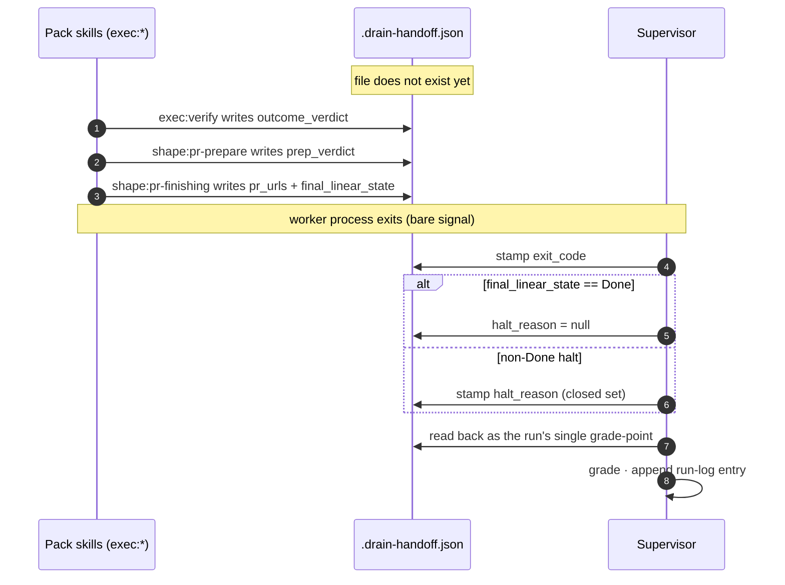

# ADR 0002: Thin-supervisor contract — prompt-segment allocation, handoff schema v2, process/workflow boundary

**Date:** 2026-06-16
**Status:** Accepted (plan-review at `docs/adrs/references/0002-thin-supervisor-contract-plan-review.md`); **superseded in part by [ADR 0030](0030-execution-state-file.md)** — see the Amendment below.

## Amendment 2026-06-17 — single pack-owned execution-state file (supersedes the two-file model)

[ADR 0030](0030-execution-state-file.md) replaces the two-file model this ADR established (`pickup-envelope.json` carrier + consumer-named `.drain-handoff.json` exit record) with **one pack-owned execution-state file per task** (illustratively `exec-state.json`, named in the pack's own terms). Each phase's skill writes its own section as the natural output of that phase; the supervisor authors none of the content and reads only the fields it gates on (the review verdict and `pr_urls`). The artefact's reason-to-exist is no longer "state the skill writes *for the supervisor*" — it is the workflow's own record, with the supervisor as one reader among possible others. See ADR 0030 for the rationale.

Concretely, the parts of this ADR superseded by ADR 0030:

- The **§ `.drain-handoff.json` schema v2** section, including the writer/reader allocation table, the lifecycle diagram, and the halt-reason taxonomy. The fields (`pr_urls`, `final_linear_state`, `exit_code`, `outcome_verdict`, `prep_verdict`, `halt_reason`) reappear as sections of the pack-owned file in ADR 0030; the file's name and owner change. The `docs/adrs/references/drain-handoff-schema-v2.md` reference is superseded with this amendment.
- The **§ Constraints / Functional** bullets that name `.drain-handoff.json` as the contract carrier, and the **§ Schema-v2 fitness** NFR row keyed off that filename.
- The **§ Process-vs-workflow boundary chart** rows that name `.drain-handoff.json` as the supervisor's read source — corrected below against code.

The parts of this ADR **not** superseded:

- The **15-line worker prompt template** and its segment allocation (§ Prompt-segment allocation).
- The **procedure-verb grep** fitness function for the supervisor source.
- The **vendor-agnostic prose constraints** for the prompt template.
- The boundary-chart rows that do not turn on the handoff file's owner or path (worker spawn, worktree creation, halt-on-timeout, resume detection, stack-mode resolution, label resolution, the deleted `flow.py` gate).

### Boundary-chart corrections (doc-vs-code divergences caught at reopen)

The chart below mis-names the readers of `.drain-handoff.json`. Verified against `drain_cycle/`:

- `drain_cycle/grade.py` reads `~/.drain-cycle/runs/*.json` (run-log files), **not** the handoff. It groups entries by `cycle_id` and emits the per-cycle / across-cycles / verdict report.
- `drain_cycle/runlog.py` writes `~/.drain-cycle/runs/<cycle-id>-<run-timestamp>.json`. It does **not** read the handoff; the orchestrator reads the handoff and passes verdict fields into `runlog.append_entry(...)`.
- `drain_cycle/orchestrator.py` is the sole reader of `.drain-handoff.json`. It calls `handoff.read(...)` for the `pr_urls` gating signal (was submission performed?) and `handoff.read_partial(...)` for best-effort verdict carryover into the run-log entry.

The corrected boundary-chart rows read:

| Concern | Today's location | After contract | Class |
|---|---|---|---|
| Grade the run (read run-log entries) | `grade.py` | unchanged; reads `~/.drain-cycle/runs/*.json` | process |
| Run-log entry writing | `runlog.py` | unchanged; orchestrator reads the execution-state file and passes verdict fields into `runlog.append_entry(...)` | process |
| Read the worker's execution state at exit | `orchestrator.py` (`handoff.read` for `pr_urls`; `handoff.read_partial` for verdict carryover) | unchanged in actor; the file becomes the pack-owned execution-state file per ADR 0030 | process |

### Schema-v2 verdict fields were never built on the handoff

The ADR records `outcome_verdict` and `prep_verdict` as writer-allocated to `exec:verify` and `shape:pr-prepare` respectively. The reader and dataclass support shipped (`drain_cycle/handoff.py`, `drain_cycle/orchestrator.py`, `drain_cycle/runlog.py`, `drain_cycle/kr2_check.py`), but **no pack-side producer was ever wired to call `handoff.write(...)` with those fields populated** — `handoff.read_partial` returns `(None, None)` on every live drain today. The rename to the pack-owned file is therefore not a migration of an in-use producer; the verdict-field producers will be authored against the new file's section contract in the build nodes that follow this amendment (ABA-399, ABA-400).

### Decoupled from §24 (prompt collapse)

The §26 rename is independent of §24 (the prompt-collapse work that thinned `prompt.py`'s tail into the pointer-only template). The file-rename build nodes do not edit the prompt template, the procedure-verb grep, or the 15-line fitness check; the §24 work does not touch the handoff file's name or owner. Either can land without the other.

## Original ADR (decision text retained for history)

The supervisor hands the worker process facts and one skill pointer — never the procedure itself; the pack owns every workflow step. Two mechanical checks keep it thin: the prompt template stays within 15 lines (`wc -l`) and a grep finds no procedure verbs in `drain_cycle/`.

This ADR pins that split: the 15-line worker prompt template and how its lines are allocated, the `.drain-handoff.json` schema (v2), and where the line between process and workflow falls across every `drain_cycle/` concern. It extends the pack's execution-workflow design doc (`agent-skills-shaper/docs/design-docs/execution-workflow/design-doc.md`) — which owns the `exec:*` skill graph — with the supervisor's half of the contract: what it hands the worker, and what the worker leaves behind. It does not re-open that skill graph.

## Context

The drain-cycle supervisor's worker prompt today inlines the workflow it wants run: a preamble names the worktree and base branch, then a tail script enumerates "review → fix → commit → push → comment → transition to Done." `drain_cycle/prompt.py` emits ~80–120 lines depending on stack mode, and `flow.py` branches the tail on the `verify` label. The pack's `exec:*` skills own that same procedure — two sources of truth for one workflow, and the drift between them is silently absorbed by the worker.

Three parties pay for this. The supervisor keeps a prompt template per state and rewrites it whenever a skill changes its output. Pack-skill authors can't change `exec:finish` without a matching edit in the supervisor repo. Non-Claude workers (codex, kimi) either re-implement the inlined procedure or quietly skip steps. And the handoff file compounds it: v1 carries `pr_urls`, `final_linear_state`, and `exit_code` — enough to grade a run, but not to see *why* a worker halted or *which acceptance criteria* it failed.

The pack's execution-workflow doc already owns the `exec:*` skill graph (`exec:pickup → exec:breakdown → exec:build → … → exec:finish`) and `pickup-envelope.json`, the carrier that moves between skills during a run. This contract adds only the supervisor's two artefacts — the shape of the prompt handed in, and the schema of the handoff left behind. Moving the inlined verbs (`/code-review-and-quality`, `/shape:task`, the completion prose) into the `exec:*` skills is pack-side work; this contract fixes what has to outlast that move.

One supervisor-computed fact has to survive it: **stack mode**. The supervisor resolves it from the `--no-stack` flag and the `push_to_main_repos` config; the worker still needs it to tell `shape:pr-finishing` whether to submit a Graphite stack or a plain `gh` PR, so the prompt has to carry it.

Today `flow.py` gates a multi-role verify pipeline (Task-Shaper → Implementer → Outcome Verifier → PR Preparer) on the issue's `verify` label. **This contract makes verification universal**: the Outcome Verifier and PR Preparer run on every drain, so the gate selects nothing. `flow.py` deletes, the `verify` label stops being a routing input, and the handoff carries no `flow` field — one flow, no path to record.

Two related decisions live in the pack repo: ADR 0003 (persona-dispatch — vendor-specific branching stays inside `exec:review`) and ADR 0004 (the `exec:*` verb namespace).

### Constraints

**Functional.**

- The worker prompt template must transmit *only* process facts and a single skill pointer. No procedure prose. No conditional branches inside the prompt body.
- The `stack` mode is a supervisor-resolved fact; it must reach the worker via the prompt template (not via a file the skill loads). Label-driven supervisor decisions (`repo:`, `model:`, `review:`) are resolved before the worker spawns and do not reach the prompt.
- `.drain-handoff.json` must carry the verdict fields the supervisor reads at run-end to (a) grade the run, (b) build the run-log entry, and (c) name the halt reason on any non-Done exit. Every field has a named writer and a named reader.
- The schema must extend `pickup-envelope.json` rather than duplicate it. `pickup-envelope.json` is the carrier that moves *between skills* during a run; `.drain-handoff.json` is the exit record handed *from the worker back to the supervisor*.
- A non-Claude worker reading the prompt must be able to follow it. No Claude-Code-only tool names. No SDK-specific framings.

**Non-functional.**

| NFR | Target | Fitness function |
|---|---|---|
| Worker prompt template size | ≤15 lines including blanks | `wc -l drain_cycle/prompt_template.txt` ≤ 15 on the rendered template skeleton (before issue-body substitution) |
| Procedure-verb absence | No execution slash-command in the supervisor source other than `/exec:pickup` | `git grep -nE '/(code-review\|shape:(pr-\|verify-\|task)\|exec:(build\|review\|verify\|finish\|breakdown\|debug\|simplify))' drain_cycle/` returns empty |
| Schema-v2 fitness | `.drain-handoff.json` produced by any worker exit parses against the JSON Schema in `docs/adrs/references/drain-handoff-schema-v2.md` and every required field is present per its writer's exit gate | Extract the fenced JSON Schema, validate every `~/.drain-cycle/runs/*.json` against it; exit 0 on every fixture and every live run |
| Vendor portability | Zero vendor tool-names in the rendered template (exact list in §Vendor-agnostic prose constraints) | `grep -iE '(claude\|anthropic\|toolsearch\|agent tool)' drain_cycle/prompt_template.txt` returns empty |

## Decision

Two decisions on the prompt and the schema, plus the boundary chart and the vendor constraints. Alternatives for each are in the next section.

### Prompt-segment allocation (the ≤15-line budget, line by line)

The worker prompt template, with placeholders in `{BRACES}`:

```
Issue {ISSUE_ID} — {ISSUE_TITLE}                                        [1]
URL: {ISSUE_URL}                                                        [2]
Worktree: {WORKTREE_PATH}                                               [3]
Base branch: {BASE_BRANCH}                                              [4]
Stack mode: {STACK_MODE}                                                [5]
Resume: {RESUME_MARKER}                                                 [6]
                                                                        [7] blank
Issue body:                                                             [8]
{ISSUE_BODY}                                                            [9]
                                                                        [10] blank
Pick up this issue and drain it to Done by invoking the skill below.    [11]
/exec:pickup                                                            [12]
```

12 lines — three lines under the 15-line limit, room for a future single-line addition (e.g., a `Cycle: ` line) without breaching it.

**Segment classification:**

| Line | Segment | Class | Source |
|---|---|---|---|
| 1 | Issue id + title | context | Linear payload |
| 2 | URL | context | Linear payload |
| 3 | Worktree path | process | supervisor (worktree manager) |
| 4 | Base branch | process | supervisor (run config) |
| 5 | Stack mode (`stack`\|`no-stack`) | process | supervisor (stack-mode resolution) |
| 6 | Resume marker (`none`\|`true`) | process | supervisor (continuation detector) |
| 8–9 | Issue body | context | Linear payload |
| 11–12 | Pointer prose + slash-command | pointer | template constant |

**Process segments are counted inside the budget.** Lines 3–6 are four of the twelve — the 15-line limit forces every process fact to earn its line.

**The procedure-verb grep.** The second thinness check scans the supervisor source for any procedure verb that leaked back in:

```
git grep -nE '/(code-review|shape:(pr-|verify-|task)|exec:(build|review|verify|finish|breakdown|debug|simplify))' drain_cycle/
```

Expected output: empty. The only execution slash-command named in `drain_cycle/` is `/exec:pickup` (in `prompt_template.txt` line 12). The pattern catches every current and future execution verb the pack might author; new verbs add to the regex, never to the supervisor.

### `.drain-handoff.json` schema v2

```json
{
  "pr_urls": ["https://github.com/…/pull/123"],
  "final_linear_state": "Done",
  "exit_code": 0,
  "outcome_verdict": {
    "result": "pass",
    "failed_ac": []
  },
  "prep_verdict": {
    "route": "auto-merge",
    "reasoning": "additive; passes carve-out; CI green"
  },
  "halt_reason": null
}
```

**Writer / reader allocation:**

| Field | Type | Writer | Reader | Required |
|---|---|---|---|---|
| `pr_urls` | `string[]` | `shape:pr-finishing` (invoked by `exec:finish`) | supervisor (grade); review-summary commenter | yes on Done exit |
| `final_linear_state` | `string` | `shape:pr-finishing` | supervisor (grade); run-log writer | yes |
| `exit_code` | `int` | supervisor (on worker exit) | supervisor (grade); inspector | yes |
| `outcome_verdict` | `{result: "pass"\|"fail", failed_ac: string[]}` | `exec:verify` (via `shape:verify-implementation`) | supervisor (run-log); inspector | yes once verify has run; absent on halts before verify |
| `prep_verdict` | `{route: "auto-merge"\|"human-review", reasoning: string}` | `shape:pr-prepare` (invoked by `exec:finish`) | supervisor (run-log); inspector | yes on Done exit; absent on halts before finish |
| `halt_reason` | `string \| null` | supervisor (on non-Done halt) | supervisor (run-log); inspector | required when `final_linear_state != "Done"`; `null` otherwise |

**This table extends the execution-workflow doc's handoff table.** That doc stops at `exec:finish`'s outputs (review verdict, verify result, PR body); these rows carry those verdicts into `.drain-handoff.json`, so the supervisor — which never reads `pickup-envelope.json` — can grade the whole run from one file.

**Lifecycle — when each field lands.** The file is written across the run by the pack, then stamped and read once by the supervisor at the worker's exit. The worker's process exit is a bare signal; the meaning of the run lives in the file.



**Halt-reason taxonomy** (the closed set `halt_reason` draws from):

| Code | Meaning | Set by |
|---|---|---|
| `worker-exit-1` | Worker process exited non-zero before reaching `exec:finish` | supervisor |
| `timeout` | Wall-clock budget exhausted | supervisor |
| `repeated-exit-1` | Consecutive-failure escalation tripped | supervisor |
| `verify-fail-noloop` | `outcome_verdict.result == "fail"` and `exec:build`'s remediation budget exhausted | `exec:verify` (passed up); supervisor records |
| `pr-blocked` | `shape:pr-finishing` could not submit (Graphite/gh error, base diverged) | `shape:pr-finishing` (passed up); supervisor records |
| `human-review-requested` | `prep_verdict.route == "human-review"`; run halts before merge | `shape:pr-prepare` (passed up); supervisor records |

### Process-vs-workflow boundary chart

| Concern | Today's location | After contract | Class |
|---|---|---|---|
| Worker spawn (subprocess invocation) | `orchestrator.py` | unchanged | process |
| Worktree creation / cleanup | `orchestrator.py` | unchanged | process |
| Halt on timeout / repeated exit-1 | `orchestrator.py` | unchanged | process |
| Resume detection (continuation marker) | `orchestrator.py` | unchanged; appears as line 6 | process |
| Grade the run (read `.drain-handoff.json`) | `grade.py` | unchanged; new fields available | process |
| Per-run `stack` flag resolution | `orchestrator.py` | unchanged; appears as line 5 | process |
| Per-issue label resolution (`repo:`, `model:`, `review:`) | `linear.py` / `model.py` / `repos.py` | unchanged; resolved before spawn, not passed to the worker | process |
| Pickup envelope creation | inlined in prompt preamble | `exec:pickup` | workflow |
| Breakdown into tasks | `/shape:task` directive in tail | `exec:breakdown` (invoked by `exec:pickup`) | workflow |
| RED/GREEN/commit loop | inlined in tail | `exec:build` | workflow |
| Code review fan-out | `/code-review-and-quality` (4 sites) | `exec:review` | workflow |
| AC verification | inlined in tail | `exec:verify` (now on every drain) | workflow |
| PR submission (Graphite vs gh) | two preamble variants | `shape:pr-finishing` (invoked by `exec:finish`); supervisor signals mode via line 5 | workflow |
| Review-summary comment + Linear Done transition | numbered prose in tail | `exec:finish` | workflow |
| Verify pipeline gating (`verify`-label check) | `flow.py` | deleted — verification runs on every drain | removed |
| Run-log entry writing | `runlog.py` | supervisor reads `.drain-handoff.json` and appends to `~/.drain-cycle/runs/*.json` | process |

The concrete supervisor-side removals, deferred to the build-out: `flow.py` deletes; `prompt.py`'s `is_verify_flow()` and `_shape_task_directive()` delete; `orchestrator.py`'s `flow.resolve()` call and `issue.verify_flow` telemetry attribute delete; `runlog.py`'s `flow` field drops to match this schema.

### Vendor-agnostic prose constraints

- The prompt template contains no instance of `Claude`, `Anthropic`, `Skill` (capitalised tool name), `Agent` (capitalised tool name), `ToolSearch`, or any SDK identifier. The pointer is a slash-command name; its expansion is the worker runtime's responsibility.
- Every pack-skill workflow section, except `exec:review`'s persona-dispatch block, is written in vendor-neutral imperative prose (no "use the Agent tool", no "via `claude -p`"). The pack's own ADR 0003 is the one place vendor-specific branching lives.
- All artefacts (`pickup-envelope.json`, `.drain-handoff.json`, `build-log.md`) are POSIX-path text files written via plain filesystem APIs.
- Slash-command syntax `/<namespace>:<verb>` is treated as the worker's responsibility to resolve; the prompt only *names* it. A worker without a slash-command runtime maps it to whatever its command registry is.

## Alternatives considered

### Prompt-segment allocation

The choice is how much the worker prompt carries. P1 sends structured facts plus one pointer; P2 adds inlined resume prose on resumed runs; P3 sends only the pointer and pushes the facts out to env vars or sidecar files.

**Alt P1 — facts + one pointer (chosen).** *Keeps the prompt inspectable and under the line budget while the skill, not the prompt, owns every procedure step.* The 12-line template above. A miss shows immediately at the `wc -l` check; behaviour degrades gracefully because the procedure lives in the skill; recovery is a one-line template edit. *Reversal cost:* low — the template is one file (`drain_cycle/prompt_template.txt`).

**Alt P2 — P1 plus inlined resume prose (rejected).** *Buys a more explicit resume instruction at the cost of two templates that must stay in sync.* Resumed runs get a second template variant whose prose tells the worker to inspect, decide, and continue — exactly the procedure shape the grep is built to catch. The resume case is already a structured marker (`resume: true|false`) the skill reads, so the prose re-imports a workflow concern the marker already covers. *Reversal cost:* medium.

**Alt P3 — bare pointer, facts in env vars or sidecar files (rejected).** *Shrinks the prompt to one line but scatters the facts and couples the pack to the supervisor.* Env-var conventions differ by runtime (codex's exposure is not Claude Code's); an operator inspecting a halted run can no longer read what the worker knew; and the skill must treat a missing file as recoverable, spreading supervisor-coupling into the pack. *Reversal cost:* high — once one runtime binds to env-var names, every other runtime must be retrofitted.

**Decision: P1.** It is the only option that clears all three binding constraints at once: the `wc -l` check (template within the limit), the portability NFR (no runtime-specific facts), and prompt-log inspectability (the operator reads the worker's inputs straight from the prompt). P2 fails the size check and the grep; P3 fails portability and inspectability. P2 is the closest call — its resume prose looks like useful guidance — but the resume marker is a process *fact*, not a workflow step, so it stays a structured field.

### Handoff schema v2

The choice is how the verdict data is structured across files and versions. H1 adds fields to the one existing file; H2 wraps that file in a version envelope; H3 splits the data into one file per skill.

**Alt H1 — flat extension of v1 (chosen).** *Adds three fields to the existing file; a reader ignores any field it does not recognise.* v1 carries `pr_urls`, `final_linear_state`, `exit_code`; v2 adds `outcome_verdict`, `prep_verdict`, `halt_reason`. No `schema_version` field, no nesting — a missing v2 field reads as v1, backwards compatible by absence. A renamed field is caught by the schema-fitness check; a missing required field on a Done exit is caught by the writer's exit gate. *Reversal cost:* low.

**Alt H2 — versioned envelope (rejected).** *Tracks versions explicitly but forces every writer to set a field that solves a problem we do not have.* `schema_version: 2` wraps nested `v1` and `v2` records. Every writer must stamp the version; a mismatched value routes silently to the wrong reader; and there is only one reader today (the supervisor), so the envelope encodes a divergence that does not exist. *Reversal cost:* medium.

**Alt H3 — per-skill handoff files (rejected).** *Gives each skill its own file at the cost of a torn multi-file state the supervisor must reassemble.* `.exec-verify.json`, `.exec-finish.json`, and so on. The supervisor would depend on a set of files in a known order; a halt between `exec:verify` and `exec:finish` leaves the set half-written; and the run-log loses its single grade-point. *Reversal cost:* high.

**Decision: H1.** One file, additive fields, one grade-point. H2 adds versioning machinery for a second reader that does not exist; H3 trades the single grade-point for a multi-file state that tears on any mid-run halt.

## Consequences

**Positive.**

- One contract that the prompt template, the schema, and the pack-skill workflows all bind to. Drift is caught at one of three named fitness checks (template `wc -l`, supervisor grep, schema parse) — all mechanical, nothing to interpret at review time.
- The handoff carries enough to drive a future "post review-summary to Linear" automation entirely off one file.
- A non-Claude worker can be pointed at this prompt and the published `exec:*` skills with no further glue; the only Claude-Code-specific code path is the persona-dispatch branch inside `exec:review`, which has a documented inline-sequential fallback.

**Negative.**

- The 12-line template has three lines of margin to absorb future facts. If a fifth process segment appears (e.g., a per-run sandbox identifier), the limit is re-negotiated at plan-review — not silently raised.
- Verification is universal: every drain runs the Outcome Verifier and PR Preparer, even a trivial doc-only issue, with no per-ticket opt-out. This is the accepted cost of one correctness contract — the verify pipeline's runtime is paid on every run. If a class of issues later proves to need a lighter path, that is a new contract decision, not a label toggle.
- The `halt_reason` taxonomy is a closed set. A halt cause outside it must extend the set before the run-log will validate — a one-line schema edit and a writer change, never a widening of the field to an open string. Speculative additions are out of scope.

**No separate walking skeleton.** The whole design surface is two files — the prompt template and the schema. The first real drain through the new template *is* the skeleton; this contract just unblocks it.

## Operability

**Metrics.** Per drained run, recorded in `~/.drain-cycle/runs/<run-id>.json` from the handoff:

- `outcome_verdict.result` rate — verify-pass rate across every drain.
- `prep_verdict.route` distribution — auto-merge vs human-review split.
- `halt_reason` histogram — shows which halt path dominates.
- Wall-clock time per run — for cycle-throughput grading.

**Structured logs.** The supervisor emits one stderr JSON line per run boundary (`{event: "run-start" | "run-end", run_id, issue_id, exit_code, halt_reason}`). No vendor SDK in the log line.

**Traces.** Not required at this stage — drain volume is low and single-user. If volume grows past ~10 drains/day, add a span per `exec:*` skill invocation parented to the pickup span (deferred).

**Alerts.** None — single-user CLI; halts appear on stderr and in the run-log.

**Rollback.**

1. If the pointer-only prompt template causes 3 consecutive halts the inlined preamble would have completed, revert `drain_cycle/prompt_template.txt` to the prior inlined tail. Gate: re-run one failed issue with the reverted template; expect Done.
2. If schema v2 fields are written but the run-log parser breaks, revert the parser to the v1 field set and accept `null` verdict columns until fixed. Gate: the schema-check one-liner returns 0 on every existing run file.
3. If the halt-reason taxonomy is missing a code a halt path needs, extend the closed set with one entry and re-run. Gate: the next halted run writes a non-null `halt_reason` in the new code.

Each step is independently reversible without coordinated cross-repo work; the contract change is structurally two-way for the prompt and additive for the schema.

**Capacity headroom.** `.drain-handoff.json` per run: ≤4 KB. `pickup-envelope.json`: ≤2 KB per drain (per the execution-workflow doc). Run-log growth: one file per run; trim after a year.

**Known failure modes.**

| Failure | Surface | Mitigation |
|---|---|---|
| Template re-grows past 15 lines | prompt-size check fails | `wc -l` runs in the pre-merge check; no merge while red |
| Procedure verb leaks into supervisor source | procedure-verb grep fails | the grep runs in the same pre-merge check |
| Writer/reader allocation drifts (a field written nowhere) | run-log shows `null` where required | schema fitness check parses live handoffs; a missing required field on a Done exit is a CI failure |
| Halt-reason taxonomy outgrown | unrecognised code in run-log | schema validates against the closed set; an unknown code fails parse, forcing the taxonomy edit before merge |
| `pickup-envelope.json` and `.drain-handoff.json` confused | a field written to the wrong file | the execution-workflow doc owns the envelope columns; this contract owns the handoff columns |

**Dependencies.** Upstream: Linear API (reads the issue payload — labels for pre-spawn resolution, issue body for lines 8–9); on failure the supervisor halts with a comment naming the API as the blocker, no run starts. Downstream: `drain_cycle/prompt.py` consumes only the template + the per-issue facts; the pack consumes only the slash-command name `/exec:pickup`.

## Open questions

| Question | Working default, and when it's settled |
|---|---|
| **Q1.** When `prep_verdict.route == "human-review"`, does the run halt (worker exits non-zero, operator merges by hand) or finish in a Done-equivalent state with a different Linear status? | Halt with `halt_reason: human-review-requested`; the supervisor records a Done-equivalent run-log outcome but leaves the issue untransitioned. Settled when the supervisor wiring lands. |
| **Q2.** Does the per-task model annotation belong on the handoff (so the run-log can grade model-tier coverage), or only on `pickup-envelope.json`? | Keep it envelope-internal; the handoff records verdict-level facts only. Settled when the schema tests are written; re-open if a grader ever needs model-tier columns. |
